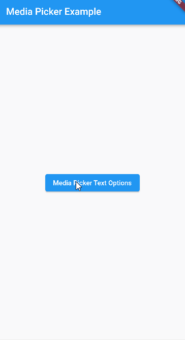

[](https://github.com/tenhobi/effective_dart)

# Flutter Media Picker
Flutter package which adds a dialog to pick various types of media.



## Setup

Add dependency to the pubspec.yaml

```yaml
flutter_media_picker:
  git:
    url: https://github.com/Iconica-Development/flutter_media_picker.git
    ref: <latest release>
```

## How to use

See [example](./example/)

## Issues

Please file any issues, bugs or feature request as an issue on our [GitHub](https://github.com/Iconica-Development/flutter_media_picker/issues) page. Commercial support is available if you need help with integration with your app or services. You can contact us at [support@iconica.nl](mailto:support@iconica.nl).

## Want to contribute

If you would like to contribute to the plugin (e.g. by improving the documentation, solving a bug or adding a cool new feature), please carefully review our [contribution guide](../CONTRIBUTING.md) and send us your [pull request](https://github.com/Iconica-Development/flutter_media_picker/pulls).

## Author

This flutter_media_picker for Flutter is developed by [Iconica](https://iconica.nl). You can contact us at <support@iconica.nl>
